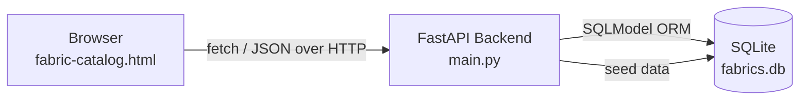

# System Architecture

## Overview

Selvage is a two-tier web application: a browser-based frontend talks to a
Python REST API, which persists data in a SQLite database.

## Layers

**Frontend (`frontend/fabric-catalog.html`)**
Plain HTML/CSS/JavaScript. No framework or build step — a single file that:
- Fetches the fabric list from the API on load
- Renders it as a searchable, filterable grid of "swatch cards"
- Sends create/update/delete requests back to the API on user actions

**Backend (`backend/`)**
- `main.py` — FastAPI app exposing REST endpoints (`/fabrics`, `/stats`)
- `models.py` — SQLModel data model + request/response schemas
- `database.py` — database engine/session setup
- `seed.py` — populates sample data for demos and development

**Data (`fabrics.db`)**
A single SQLite file. Adequate for a single-store prototype; would move to
PostgreSQL for multi-store/production use (connection string change only —
the ORM layer doesn't need to change).

## Request flow example: adding a fabric

1. User fills out the "Add Fabric" form in the browser and clicks Save.
2. Frontend sends `POST /fabrics` with the form data as JSON.
3. FastAPI validates the payload against the `FabricCreate` schema.
4. SQLModel inserts a new row into `fabrics.db`.
5. The API returns the saved fabric (now including its database ID).
6. The frontend re-fetches the fabric list so the new card appears.

## Why this stack

- **FastAPI** — automatic interactive API docs (`/docs`), fast to build with,
  well-documented, widely used in industry.
- **SQLModel** — combines the database model and the API's data-validation
  schema in one place, reducing duplication.
- **Plain HTML/JS frontend** — no build tooling required, easy to demo from
  a single file, sufficient for the scope of this project.