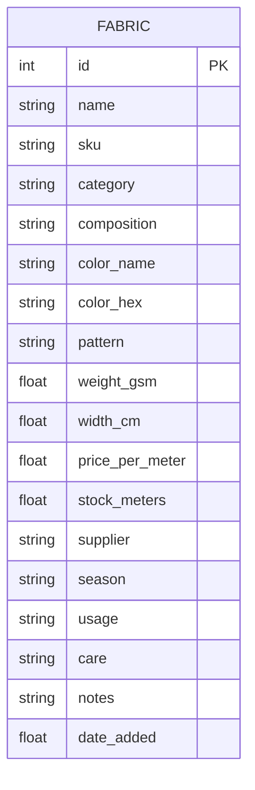

# Data Model / ER Diagram

The system currently has a single core entity: **Fabric**. Everything else
(categories, low-stock status) is derived from its fields rather than stored
in separate tables.

## Field notes

| Field | Type | Purpose |
|---|---|---|
| `sku` | string | Unique stock-keeping code, generated from category + name |
| `category` | string | One of: Cotton, Linen, Silk, Wool, Denim, Polyester, Rayon/Viscose, Knit, Blend |
| `composition` | string | Free text, e.g. "60% cotton, 40% polyester" |
| `color_hex` / `color_name` | string | Drives the swatch preview in the UI |
| `weight_gsm` | float | Fabric weight in grams per square meter — standard textile measure |
| `stock_meters` | float | Current inventory; flagged "low" below 20m |
| `date_added` | float (unix timestamp) | Used for "recently added" sorting |

## Future extensions (not yet implemented)

If the system grows beyond a single-store prototype, natural next entities
would be:

- **Supplier** (name, contact info, lead time) — currently just a text field
  on Fabric; would become its own table with a foreign key once multiple
  fabrics need to share verified supplier records.
- **User** (staff accounts, roles) — needed once authentication is added.
- **StockMovement** (fabric_id, quantity_change, reason, timestamp) — would
  turn `stock_meters` from a single number into an auditable history of
  restocks and usage.